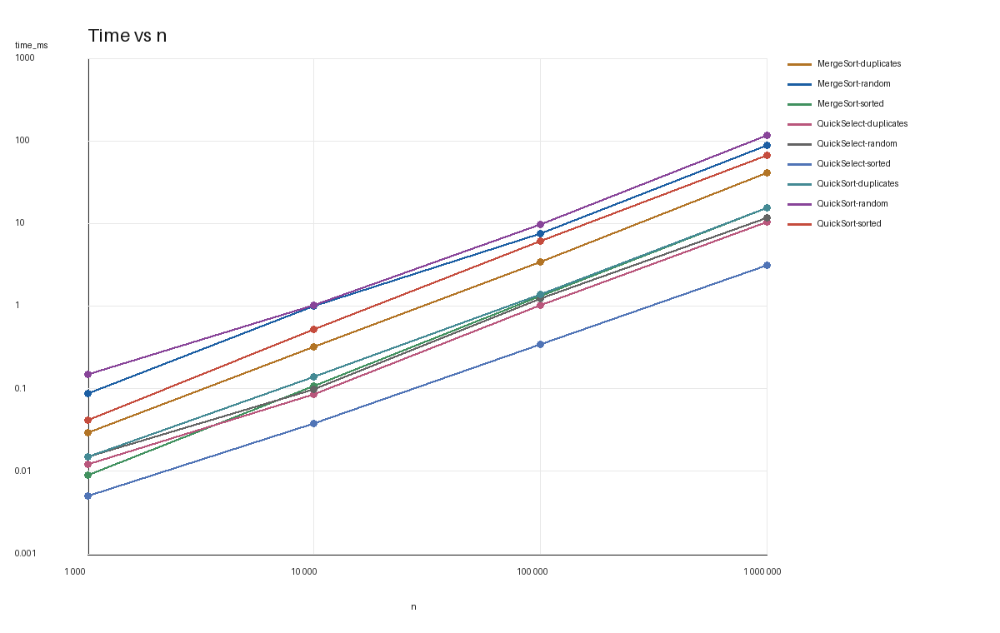
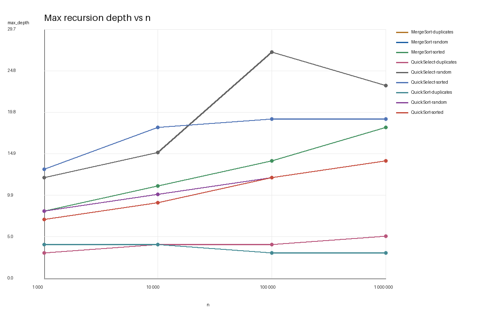
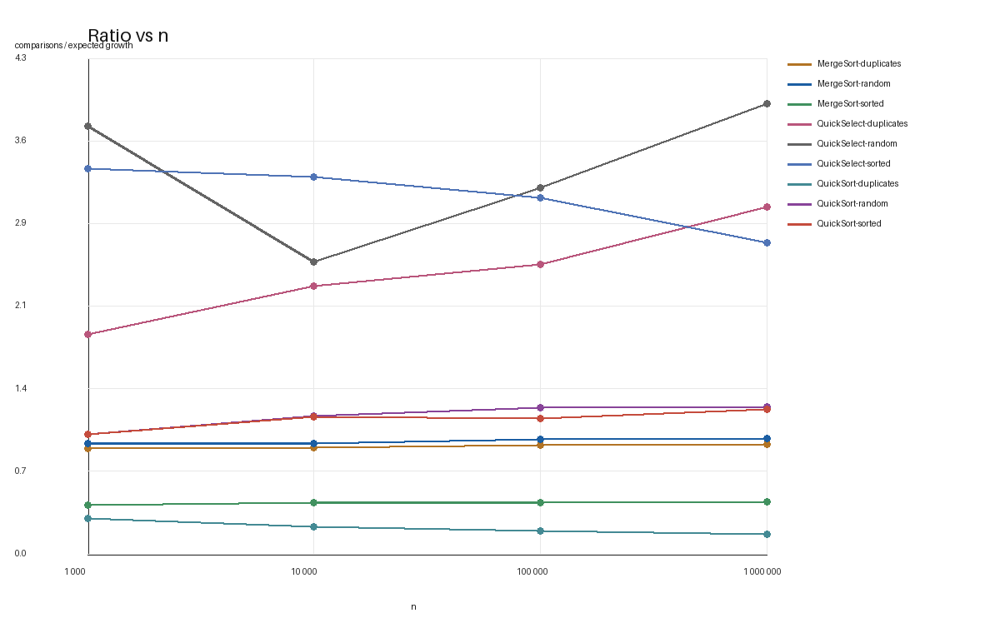

# Assignment 1 Report - Divide and Conquer

## Asymptotic Bounds

| Algorithm | Best | Average | Worst |
|---|---|---|---|
| MergeSort | Theta(n log n): every level merges all n items | Theta(n log n): balanced halves at all levels | Theta(n log n): same split structure for every input |
| QuickSort | Theta(n): all keys equal collapse into the middle 3-way partition | Theta(n log n): random pivot gives balanced splits in expectation | O(n^2): repeatedly choosing an extreme pivot still can happen |
| QuickSelect | Theta(n): pivot range contains k early or all keys equal | Theta(n): only one side continues after partitioning | O(n^2): repeated extreme pivots shrink the array by one |
| Insertion Sort | Theta(n): already sorted input makes one failed comparison per item | Theta(n^2): random items move about half-way on average | Theta(n^2): reverse order shifts every previous element |

## Recurrences

MergeSort uses T(n) = 2T(n/2) + Theta(n). Here a = 2, b = 2 and f(n) = Theta(n). This is Master Theorem case 2 because f(n) matches n^(log_b a), so T(n) = Theta(n log n).

QuickSort with a balanced split uses T(n) = 2T(n/2) + Theta(n), therefore it is also Master Theorem case 2 and T(n) = Theta(n log n). A random pivot does not guarantee a balanced split every time, but it makes consistently bad pivots unlikely. Over many partitions the expected split quality gives O(n log n) average time.

QuickSelect with a balanced split uses T(n) = T(n/2) + Theta(n). Here a = 1, b = 2 and f(n) = Theta(n), which is Master Theorem case 3, so T(n) = Theta(n).

Insertion Sort is iterative rather than divide-and-conquer. Its running time is Theta(n) on sorted input and Theta(n^2) when many elements must be shifted.

## Plots

## Theta Check

For sorting algorithms the plotted ratio is comparisons / (n log2 n). For QuickSelect it is comparisons / n.

- MergeSort-duplicates: c1 ~ 0.940, c2 ~ 0.949, n0 = 100000
- MergeSort-random: c1 ~ 0.987, c2 ~ 0.997, n0 = 100000
- MergeSort-sorted: c1 ~ 0.445, c2 ~ 0.453, n0 = 100000
- QuickSelect-duplicates: c1 ~ 2.502, c2 ~ 2.999, n0 = 100000
- QuickSelect-random: c1 ~ 3.163, c2 ~ 3.893, n0 = 100000
- QuickSelect-sorted: c1 ~ 2.686, c2 ~ 3.073, n0 = 100000
- QuickSort-duplicates: c1 ~ 0.198, c2 ~ 0.226, n0 = 100000
- QuickSort-random: c1 ~ 1.216, c2 ~ 1.262, n0 = 100000
- QuickSort-sorted: c1 ~ 1.194, c2 ~ 1.204, n0 = 100000

The ratios for MergeSort and QuickSort stay within a narrow constant band after n = 100000, which supports the expected Theta(n log n) behavior. QuickSelect ratios are also nearly constant for random and sorted inputs, matching expected Theta(n). Duplicate-heavy input is lower because 3-way partitioning removes the entire equal-to-pivot block at once.

## Discussion

The measurements match the theoretical behavior: MergeSort grows like n log n, QuickSort stays close to n log n because of random pivots and 3-way partitioning, and QuickSelect grows close to linear because it keeps only one side. Sorted input does not break QuickSort because the pivot is random and the implementation recurses into the smaller side first. Duplicate-heavy input is especially fast for QuickSort and QuickSelect because the equal partition can be large. MergeSort performs more consistently because its recursion tree is independent of input order. Small differences between curves are caused by JVM warm-up, CPU cache effects, branch prediction and the insertion-sort cutoff. Garbage collection is limited because MergeSort allocates one helper buffer per top-level sort and QuickSort/QuickSelect work in place. The cutoff of 15 improves small subarray performance without changing the asymptotic bound.
